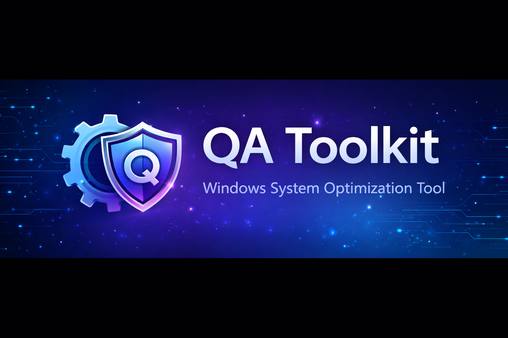

<h1 align="center">🛠 QA Toolkit</h1>

Windows System Optimization Tool 
<b>PowerShell + GUI</b>

---

# 🚀 Overview

**QA Toolkit** là công cụ **kiểm tra và tối ưu hệ thống Windows** được xây dựng bằng **PowerShell** với giao diện GUI thân thiện.

Phần mềm giúp người dùng:

✔ Kiểm tra tình trạng hệ thống  
✔ Dọn dẹp file rác Windows  
✔ Quản lý chương trình khởi động  
✔ Phân tích hiệu năng máy tính  
✔ Xuất báo cáo hệ thống chuyên nghiệp  

Mục tiêu của QA Toolkit là **giúp máy tính chạy nhanh – sạch – ổn định chỉ trong vài phút.**

---

# 📦 Download

### ⬇ Download Latest Version

👉 https://github.com/PQC-hub/QA-Toolkit/releases/latest

| File | Description |
|-----|-------------|
| **QA-Toolkit.exe** | Bản chạy trực tiếp |
| **QA-Toolkit.zip** | Source code |
| **QA-Toolkit.ps1** | PowerShell script |

---

# ✨ Features

## 🔍 System Audit
Phân tích toàn diện hệ thống:

- CPU
- RAM
- Disk
- Windows version
- Startup programs

---

## 🧹 Temp Cleanup
Dọn dẹp các file không cần thiết:

- Temp files
- Windows cache
- Browser cache
- Update leftovers

---

## ⚡ Startup Manager

Quản lý chương trình khởi động:

- xem danh sách startup
- disable ứng dụng nặng
- tăng tốc khởi động Windows

---

## 📊 System Health Score

Tính toán **điểm sức khỏe hệ thống (0–100)** dựa trên:

- dung lượng disk
- startup load
- temp files
- system status

---

## 📄 HTML Report

Xuất **báo cáo hệ thống dạng HTML**:

- thông tin phần cứng
- tình trạng hệ thống
- startup analysis
- health score

---

# 🖥 Program Interface

---

# ⚙️ System Requirements

| Requirement | Minimum |
|---|---|
OS | Windows 10 / Windows 11 |
PowerShell | 5.1+ |
Permissions | Administrator |

---

# 🛠 Installation

## Method 1 – Download Release

1️⃣ Download từ trang **Releases**
